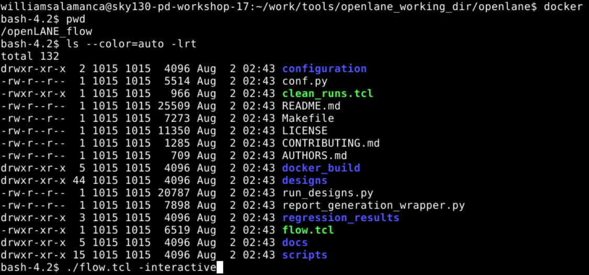

# OpenLane-Workshop
Repository of the 5 days OpenLane Workshop made on August 2022

[TOC]

## Glossary

  
Expand/Collapse

    <dl>
        <dt> </dt>
        <dd> </dd>
        <dt>ASIC:</dt> 
        <dd>Application specific integrated circuit.</dd>
        <dt>DFT: </dt>
        <dd>Design for Test is an optional step in the OpenLane flow. </dd>
        <dt>DRC: </dt>
        <dd>Desing Rule Checking </dd>
        <dt>EDA Tools:</dt> 
        <dd>Electronic Design Automation Tools.</dd>
        <dt>GDSII:</dt>
        <dd>Stands for Graphic Design System, and it's the binary file format for IC Design EDA tools. In our flow, it will be our output file. </dd>
        <dt> LEC</dt>
        <dd> Logic Equivalence Check. Done by Yosis, compares netlist after synthesis with the netlist at later stages of the process.</dd>
        <dt> LEF: </dt>
        <dd> Library Exchange Format. It is a file that includes not detailed information of the cells.</dd>
        <dt>LVS: </dt>
        <dd>Layout vs. Schematic. It is a verification made at the end of the workflow where original schematics are compared to the layout. </dd>
        <dt>PDK:</dt>
        <dd>Process Design Kit. Allows designer to use an specific fabrication process. </dd>
        <dt>SCL </dt>
        <dd>Standard Cell Library. It is the library that contains all the available SLC. </dd>
        <dt>SLC </dt>
        <dd>Standard Logic Cells. This are the primitives availables for implementation. This cells are defined in the PDK(?). It includes electrical and layout models. </dd>
        <dt>STA: </dt>
        <dd>Static Timing Analysis. At any moment of the procces this is made to make sure that the timing constraints are met. </dd>
    </dl> 

 

## Day 1
ASIC design requires three main components: the RTL design, the EDA tools and the PDK Data.

Recently in 2020, Google and Skywater release the first open source PDK for 130ns.
### Simplified Work Flow
In the next image, a simplified work flow is presented

The main stages presented are:
#### Synthesis
During this stage the RTL input is converted to standard logic cells. This process is similar to the synthesis in an FPGA workflow. 
#### Floorplanning and Powerplanning
Different scopes can have this stage depending if you are implementing a single component or the whole chip. Here we make a distribution of the available area in rows to locate (later) the SLC inside them. The powerplanning use the top metal layers to distribute the power signals.
#### Placement
The placement locates the SLC in the available area. First making a global distribution and then a detailed distribution. The goal in this stage is to reduce the delay in the interconnections.
#### Clock Tree Synthesis
The clock is routed before the signals. Minimizing the clock skew and keep the signal integrity are the main goals here. 
#### Routing
The remaining signals are finally routed in this stage. The design rules are defined by the PDK. There are 6 metal layers in the PDK definition. The local interconect layer (the lower one) is made of titanium and the other layers are made of aluminium.
#### Sign off
In this stage, all the verifications are made. This includes: DRC, LVS and STA. 

### OpenLane
OpenLane is an Open Source Flow. As a eFabless design, we have access to many SoC called Strive. This family includes many versions with different features. It is designed to have no human intervention in the process. Anyway it has two operation modes: Autonomous and Interactive. The OpenLane flow is shown in the next image.

Each step of the process requires many opensource tools:
 - Yosis: does the synthesis but it is
 - abc: who converts the design into standard cells. The abc script can define different strategies for area or timing.
 - Synthesis Exploration: allows to compare the results of different strategies of abc. It can be done with a single utility or by a OpenLane utility.
 - Fault: Allows to run extra tools for testing the device.
 - OpenROAD: Makes the whole physical implementation. This includes several place and route steps, starting with the floor/power planning and ending with the global and detailed routing. 
  - Yosis (again): makes LEC looking for errors in the implementation steps.
  - Finally, the last errors checking is made by tools like OpenSTA (part of OpenROAD) and Magic.

### To the lab... Preparing and Synthetizing
To work with the OpenLane tools we receive access to an account and access via remote desktop. Inside the user folder, we find a work directory with all the required tools. The following file shows the directory tree of the working directory

add file... someday

The pdks directory is a soft link to a priviligiated user shared folder and its structure is this one:

add file...

In the sky130A directory we can find two folders with the tools (`libs.tech`) and the type of cells we can work with (`libs.ref`).

we are going to work with the `sky130_fd_sc_hd` which stands for high density.

[source: Youtube](https://www.youtube.com/watch?v=HvWveK2fZt0)

The real working directory is the `openlane` directory.

here we can see two tcl scripts: one for run the flow and the other to clean. The flow.tcl can be run with two modes: interactive or automated. We are going to run it using the interactive mode, but before we must run the `docker` command definded as an alias in the `.bashrc` file in the home directory.

With the command `./flow.tcl -interactive` we can access the tcl console to run each step in the flow. Before run synthesis we must prepare the design.

This command uses the tcl configuration files found in the `openlane/designs/picorv32a` folder to merge the LEF. We can check the merged results at that directory.

Finally we can run the `run_synthesis` inside the tcl console. It will take some time and generate a lot of log information.

We can check the dfxtp ratio

The calculation for the Flop ratio is:
$$\text{Flop Ratio}=\frac{1634}{14876}=10.98\text{\%} $$

The calculation for the Buffer ratio is:
$$\text{Buffer Ratio}=\frac{1656+8}{14876}=11.18\text{\%}$$ 

## Day 2

In this day we will cover the rest of the processes involved in the floorplanning and place and route. 

### Floorplanning

Floorplanning is the stage when we must distribute the cells on the available area, so we must analyze some topics.

#### Die and Core definitions
Core is the area where our cells can be placed and Die is the Silicon chip area that containts the core and the I/O pads. In our design, our cells can not utilize the 100% of the die, so we can define some metrics:

$$\text{Utilization Factor}= \frac{\text{Area occuped by netlist}}{\text{Total area of the core}}$$
$$\text{Aspect Ratio}= \frac{\text{Core Height}}{\text{Core Width}}$$

#### Preplaced cells

Any design is usually divided in many repetible blocks. And many of these blocks are usually configured in typical interconection patterns. This cluster of cells are usually preplaced manually before any other parts of the circuit and they are called preplaced cells.

#### Decoupling Capacitors

Even on a breadboard, in the early student age, we have been placing capacitors near to the digital circuits, specially on those circuits that are far from the power source. This decoupling capacitors try to minimize the voltage drop due to the switching on the digital systems which requires a lot of current from the source. This capacitors act like a local temporal power supply for this devices. This drop can be dangerous when the drop can reach the noise margins limits.

In our system, the preplaced cells must be placed with decoupling capacitors on free areas around these cells.

#### Power Planning

The decoupling capacitors can minimize the voltage drop in the powerlines of the system, but, another phenomena must be handled when many lines (like a signal bus) make the same transition (let's say one to zero). This produce a Ground Bounce because the inherent capacitance of each data line to ground. The opposite case may produce a voltage drop.

The main issue is because power source is comming from one single point, so we could place many power sources along the core but this is not possible. The solution is to make a grid of distribution of power lines. This reduces significantly the resistance in the power lines

#### Pin Placement

The pins location is over the die but out of the core. Usually, input pins and output pins are located in opposite sides of the die (left/right top/bottom). This location must keep pins and their receiving blocks as near as they can and handle the different clock domains in the core. Clock pins are bigger than other pins due to the importance of this signal, because bigger pads reduce the resistance.

#### Lab time: Floorplanning

before talk about place and route we must make the floorplanning in our design. To do this we can just run the command `run_floorplan`, but lets see some of the configuration files that determine the floorplan action.

The file located at `openlane/configuration/README.md` list and explain each of the parameters used in each of the stages of the openlane process, starting with synthesis. This file just give an explanation of each of the parameters. Making a comparison of the actual file and the version that the video has we can se that many parameters has been added on each stage.

The files that set the default values for this parameters are in the same folder. One for each step in the process. To change an specific parameter for a single design, we must go to the design folder `openlane/designs/picorv32a` to check the two `config.tcl` and `sky130A_sky130_fd_sc_hd_config.tcl` files. This two files can override any of the default parameters in the configuration folder.

After running the `run_floorplan` in the tcl console, we can check the generated files. The runs folder in the design project contains the generated files:

The log file is in `logs/floorplan/ioPlacer.log` in the video but in my own floorplan directory, the log file is splited in different parts.

Anyway, the main file generated after this process is located in the `results/floorplan` folder. It is a `.dat` folder called `picorv32a.floorplan.def`

In this file we can see the die area. For our case is $660.685\text{ x }671.405 \mu\text{m}$ 

Now we are ready to see a graphics of the placement results. we can execute:

`magic -T /home/williamsalamanca/Desktop/work/tools/openlane_working_dir/pdks/sky130A/libs.tech/magic/sky130A.tech lef read ../../tmp/merged.lef def read picorv32a.floorplan.def &`

In this interface, magic is opened and this are some useful keyboard shortcuts:

 - S key - is for selection.
 - V key - fix view to the selected object.
 - Z key - is for zoom a previously area selected with left and right click.

 
 

 In the tcl console we can also introduce commands like `what` that gives the information of the selected object

 

 ### Placement and Routing

## Day 3
## Day 4
## Day 5
